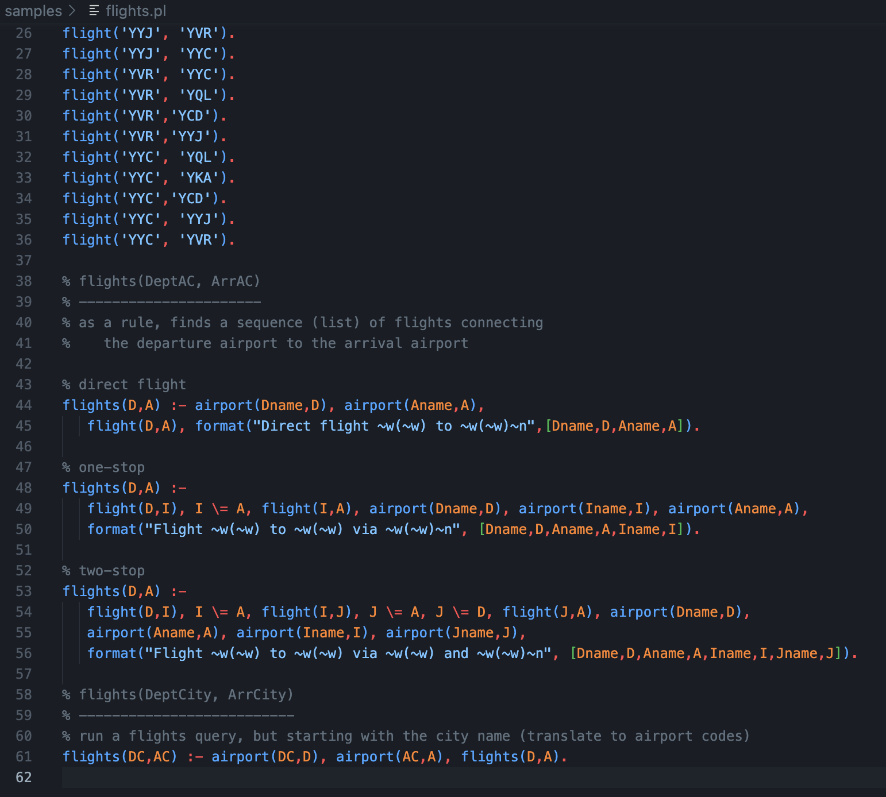

# Prolog Syntax Highlighter (SWI)

A VS Code extension for SWI-Prolog that provides syntax highlighting for Prolog source code.

## Overview

This extension provides syntax highlighting and basic editor support when editing Prolog files (`.pl`, `.pro`, `.prolog`) in VS Code.

## Main Features

### Syntax Highlighting
- **Comments**: Line comments (`%`) and block comments (`/* */`)
- **Strings**: Single-quoted (`'...'`) and double-quoted (`"..."`) strings
- **Quasi-quotations**: SWI-Prolog quasi-quotation notation (`{|...|}`）
- **Numbers**: 
  - Integers
  - Floating-point numbers
  - Hexadecimal (`0x...`)
  - Binary (`0b...`)
  - Octal (`0o...`)
  - Character codes (`0'x`)
- **Variables**: 
  - Anonymous variable (`_`)
  - Named variables (`_Var`, `Var`)
- **Directives**: `:- module`, `:- use_module`, `:- dynamic`, etc.
- **DCG notation**: `-->` operator
- **Operators**: `=`, `is`, `=:=`, `==`, `:-`, `?-`, etc.
- **Built-in predicates**: `true`, `false`, `write`, `findall`, `member`, `append`, etc.

### Editor Features
- **Auto-completion**: Auto-closing of brackets (`()`, `[]`, `{}`) and quotes (`'`, `"`)
- **Comment configuration**: Toggle support for line and block comments
- **Indentation**: Default tab size of 2 spaces

### File Associations
- Automatically recognizes `.pl` files as Prolog (configurable in settings)
- Also supports `.pro` and `.prolog` extensions
